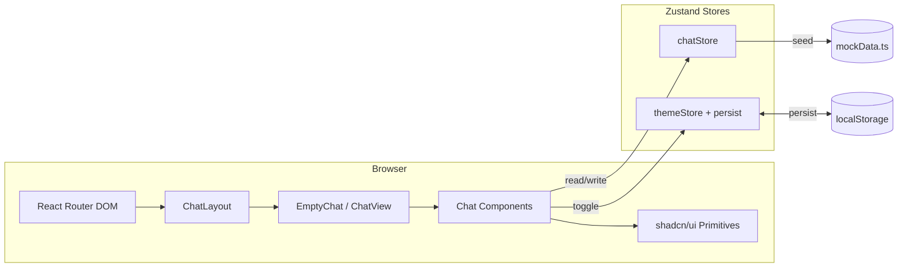

# Chat UI — Step-by-Step Build Guide

> **Archived: original build playbook.** This document is the original roadmap used to build the Chat UI application from scratch. The codebase may have evolved since this guide was written (for example, dark mode, the emoji picker, and the multiline composer were added later). For current setup, architecture, and deployment notes, see [../README.md](../README.md).

---

> **Project Summary:** Chat UI is a responsive messaging interface built on React 18, TypeScript, and Vite. It includes a conversation list, search, messages grouped by date, a typing indicator, simulated auto-replies, read receipts (delivered/read), online status badges, unread message counters, a persisted dark mode, and a dependency-free emoji picker. The application has no backend; all data comes from a mock layer and state is managed with Zustand. Form validation is handled with React Hook Form + Zod, and styling with Tailwind CSS + shadcn/ui (Radix primitives). Security (XSS-safe rendering, `noopener` external links), accessibility (`aria-*`, keyboard support), and performance (fine-grained Zustand selectors, `useMemo`) are considered from the start.

Each step below is a self-contained prompt. Execute them in order.

Stack: React 18, TypeScript, Vite, Zustand (+persist), Tailwind CSS, shadcn/ui, Radix UI, React Hook Form, Zod, React Router DOM, Lucide React.

---

## Table of Contents

**PHASE 1 — Project Foundation**

- STEP 1 — Project Scaffolding & Dependency Setup
- STEP 2 — Tooling Config (Vite, TypeScript, Tailwind, ESLint)
- STEP 3 — Global Styles & Design Tokens
- STEP 4 — Domain Types

**PHASE 2 — State & Data Layer**

- STEP 5 — Utility Helpers
- STEP 6 — Mock Data
- STEP 7 — Chat Store (Zustand)
- STEP 8 — Theme Store (Zustand + persist)

**PHASE 3 — UI Primitives**

- STEP 9 — shadcn/ui Primitives (button, input, textarea, avatar, scroll-area, separator)

**PHASE 4 — Chat Feature & Pages**

- STEP 10 — App Shell, Routing & Theme Bootstrap
- STEP 11 — Layout & Sidebar
- STEP 12 — Conversation Item
- STEP 13 — Chat View, Header & Message List
- STEP 14 — Message Bubble & Typing Indicator
- STEP 15 — Message Input, Emoji Picker & Empty State

**PHASE 5 — Polish & Deploy**

- STEP 16 — Animations, Dark Mode & Accessibility Pass
- STEP 17 — Build, Preview & Netlify Deployment

**Appendices**

- Appendix A — Shared Constants & Path Alias
- Appendix B — Reusable Patterns
- Appendix C — Common Pitfalls
- Appendix D — Pre-flight Checklist

---

## Global Build Rules (apply to EVERY step)

- **No git operations.** Do not run `git add`, `commit`, `push`, `branch`, etc. Version control is handled manually by the user.
- Do not install unapproved packages. Add a new dependency only when a step explicitly requires it; prefer native methods whenever possible.
- Do not start long-running processes (dev server, watchers) unless requested.
- Treat every step as self-contained; a step may build on previous outputs but defines its own goal clearly.
- Code must be clean, readable, and well-commented; function/variable names in English and `camelCase`.
- Security, accessibility, and performance are a priority in every step.

---

## Architecture at a Glance



The application is a single-page (SPA) client. `BrowserRouter` handles routing; `ChatLayout` hosts the sidebar plus the active chat area. All application state lives in two Zustand stores: `chatStore` (conversations, messages, active chat, typing state) and `themeStore` (light/dark, persisted to localStorage). Since there is no backend, message sending and the "other party reply" are simulated with `setTimeout`.

---

# PHASE 1 — PROJECT FOUNDATION

---

## STEP 1 — Project Scaffolding & Dependency Setup

**Goal:** Set up the Vite + React + TypeScript skeleton and add runtime/dev dependencies.

**Files/folders:** `package.json`, `index.html`, `src/main.tsx`, `public/`

**Dependencies (runtime):**

```bash
npm install react react-dom react-router-dom zustand \
  react-hook-form @hookform/resolvers zod \
  @radix-ui/react-avatar @radix-ui/react-scroll-area \
  @radix-ui/react-separator @radix-ui/react-slot \
  class-variance-authority clsx tailwind-merge \
  tailwindcss-animate lucide-react
```

**Dependencies (dev):**

```bash
npm install -D vite @vitejs/plugin-react typescript \
  @types/react @types/react-dom @types/node \
  tailwindcss postcss autoprefixer \
  eslint @eslint/js typescript-eslint globals \
  eslint-plugin-react-hooks eslint-plugin-react-refresh
```

**Notes:**

- `package.json` scripts: `dev: vite`, `build: tsc -b && vite build`, `lint: eslint .`, `preview: vite preview`.
- `index.html` contains the `#root` div and the `/src/main.tsx` module script.

**Acceptance:** `npm run dev` boots an empty React application.

---

## STEP 2 — Tooling Config (Vite, TypeScript, Tailwind, ESLint)

**Goal:** Create the `@` path alias, Tailwind/PostCSS, and ESLint configurations.

**Files/folders:** `vite.config.ts`, `tsconfig.json`, `tsconfig.node.json`, `tailwind.config.js`, `postcss.config.js`, `eslint.config.js`

**Implementation notes:**

- `vite.config.ts`: `@vitejs/plugin-react`, `resolve.alias['@'] = ./src`, `server.port = 3000`, `build.sourcemap = true`.
- `tsconfig.json`: `paths` with `"@/*": ["./src/*"]`, `strict: true`, `jsx: react-jsx`.
- `postcss.config.js`: `tailwindcss` + `autoprefixer` plugins.
- ESLint: flat config with `typescript-eslint`, `react-hooks`, `react-refresh`.

**Acceptance:** `npm run lint` runs; `@/...` imports resolve.

---

## STEP 3 — Global Styles & Design Tokens

**Goal:** Define Tailwind layers, HSL-based theme variables (light + dark), and custom animations.

**Files/folders:** `src/index.css`, `tailwind.config.js`

**Implementation notes:**

- Tokens under `:root` and `.dark`: `--background`, `--foreground`, `--primary`, `--muted`, `--border`, `--ring`, `--radius`, etc.
- `tailwind.config.js`: `darkMode: ['class']`, bind tokens to `theme.extend.colors` via `hsl(var(--...))`.
- Keyframes: `fade-in`, `slide-in`, `bounce-dots`; with matching `animation` definitions.
- Custom scrollbar styles and a `.scrollbar-hidden` utility.

**Acceptance:** Colors change when the `dark` class is added to `<html>`.

---

## STEP 4 — Domain Types

**Goal:** Define the type contracts used across the application.

**Files/folders:** `src/types/index.ts`

**Implementation notes:** `User`, `Message`, `Conversation`, `MessageFormData`, `MessageGroup` interfaces. `Message.timestamp: Date`, `Message.isRead?: boolean`.

**Acceptance:** Types are importable with no circular dependencies.

---

# PHASE 2 — STATE & DATA LAYER

---

## STEP 5 — Utility Helpers

**Goal:** Write class-merging and date/time helpers.

**Files/folders:** `src/lib/utils.ts`

**Implementation notes:**

- `cn(...inputs)` → `twMerge(clsx(inputs))`.
- `formatTime(date)` → `Intl.DateTimeFormat` producing `"2:30 PM"`.
- `formatDateHeader(date)` → `Today` / `Yesterday` / `"Jan 15"`.
- `generateId()` → `Date.now()` + base-36 random.
- `isSameDay(a, b)` → year/month/day comparison.

**Acceptance:** Pure functions; no side effects, testable.

---

## STEP 6 — Mock Data

**Goal:** Produce the users, messages, and conversations used in place of a backend.

**Files/folders:** `src/data/mockData.ts`

**Implementation notes:**

- `currentUser` and `mockUsers` (DiceBear avatar URLs, `isOnline` flags).
- `daysAgo(days, hours, minutes)` date-generation helper.
- `mockMessages: Record<conversationId, Message[]>`.
- `mockConversations`: each contains `participants`, `lastMessage`, `unreadCount`, `createdAt`, `updatedAt`; sorted by `updatedAt`.

**Acceptance:** Data is consistent; `lastMessage` points to the conversation's last message.

---

## STEP 7 — Chat Store (Zustand)

**Goal:** Centralize all chat state and actions.

**Files/folders:** `src/store/chatStore.ts`

**Implementation notes:**

- State: `conversations`, `messages`, `activeChat`, `currentUser`, `users`, `isTyping`.
- Actions: `setActiveChat`, `sendMessage`, `markAsRead`, `setIsTyping`, `getConversationMessages`, `getConversationById`, `getOtherParticipant`.
- `sendMessage`: adds the new message with `isRead: false` (delivered/single check), updates the conversation, and re-sorts by `updatedAt`; then sets `isTyping = true` and produces a random reply via `setTimeout`. When the reply arrives, the user's previous messages are marked `isRead: true` (read/double check).
- State updates are immutable (via spread).

**Acceptance:** The send → typing indicator → auto-reply flow works.

---

## STEP 8 — Theme Store (Zustand + persist)

**Goal:** Manage the light/dark theme preference and make it persistent.

**Files/folders:** `src/store/themeStore.ts`

**Implementation notes:**

- `persist` middleware with `name: 'chat-ui-theme'`.
- State: `theme: 'light' | 'dark'`; actions: `toggleTheme`, `setTheme`.

**Acceptance:** The preference survives a reload (`localStorage`).

---

# PHASE 3 — UI PRIMITIVES

---

## STEP 9 — shadcn/ui Primitives

**Goal:** Add reusable, accessible UI primitives.

**Files/folders:** `src/components/ui/button.tsx`, `input.tsx`, `textarea.tsx`, `avatar.tsx`, `scroll-area.tsx`, `separator.tsx`

**Implementation notes:**

- `button.tsx`: variants/sizes via `class-variance-authority`; Radix `Slot` for `asChild`.
- `input.tsx` / `textarea.tsx`: `forwardRef`, class merging via `cn`, focus ring.
- `avatar.tsx`, `scroll-area.tsx`, `separator.tsx`: wrap the corresponding Radix primitives.
- All support `focus-visible` rings and `disabled` states.

**Acceptance:** Primitives work in isolation; DRY and accessible.

---

# PHASE 4 — CHAT FEATURE & PAGES

---

## STEP 10 — App Shell, Routing & Theme Bootstrap

**Goal:** Wire up the router, apply the theme, and prevent FOUC.

**Files/folders:** `src/main.tsx`, `src/App.tsx`, `src/hooks/useApplyTheme.ts`, `index.html`

**Implementation notes:**

- `main.tsx`: `BrowserRouter` + `<App />`, `StrictMode`.
- `App.tsx`: Routes — `/` (`ChatLayout` → index `EmptyChat`, `chat/:id` `ChatView`), `*` → `/`. Calls `useApplyTheme()`.
- `useApplyTheme`: toggles the `dark` class on `document.documentElement` based on `themeStore.theme`.
- `index.html`: a small inline script that reads `localStorage` key `chat-ui-theme` before paint and adds the `dark` class (FOUC prevention).

**Acceptance:** The page opens with the correct theme and no flash.

---

## STEP 11 — Layout & Sidebar

**Goal:** Build the responsive shell and the conversation list.

**Files/folders:** `src/layouts/ChatLayout.tsx`, `src/components/chat/Sidebar.tsx`

**Implementation notes:**

- `ChatLayout`: based on `activeChat`, toggles between sidebar/chat on mobile (`hidden md:flex`), side-by-side on desktop.
- `Sidebar`: search input, name filter via `getOtherParticipant`, a `ConversationItem` list inside `ScrollArea`, theme toggle button (Sun/Moon), footer signature (`noopener noreferrer` external links).
- Store access via fine-grained selectors (`useChatStore((s) => s.x)`).

**Acceptance:** Search filters; the theme button works; collapses correctly on mobile.

---

## STEP 12 — Conversation Item

**Goal:** Render a single conversation row.

**Files/folders:** `src/components/chat/ConversationItem.tsx`

**Implementation notes:** Avatar + online dot, name, last-message preview (`You:` prefix, truncated at 40 chars), `formatTime`, unread badge. Clicking navigates to `/chat/:id`; the active row is highlighted.

**Acceptance:** Active/unread/online states are visually correct.

---

## STEP 13 — Chat View, Header & Message List

**Goal:** Combine the active chat, its header, and the message stream.

**Files/folders:** `src/pages/ChatView.tsx`, `src/components/chat/ChatHeader.tsx`, `src/components/chat/MessageList.tsx`

**Implementation notes:**

- `ChatView`: reads `id` via `useParams`, redirects to `/` if invalid; syncs with `setActiveChat(id)`. Does not reset to `null` on unmount (cleanup happens in `EmptyChat` to avoid flicker when switching between chats).
- `ChatHeader`: other participant info, online/offline, back button (mobile), action buttons (placeholders, with `aria-label`).
- `MessageList`: groups messages by date with an **immutable** `reduce`; `useMemo`; auto-scrolls on new message/typing.

**Acceptance:** Messages are grouped with date headers; auto-scroll works.

---

## STEP 14 — Message Bubble & Typing Indicator

**Goal:** Build the message bubble and the typing animation.

**Files/folders:** `src/components/chat/MessageBubble.tsx`, `src/components/chat/TypingIndicator.tsx`

**Implementation notes:**

- `MessageBubble`: alignment and color based on own/other message; border-radius logic for consecutive messages; timestamp; read status on own messages (`Check` / `CheckCheck`); `fade-in` animation; safe rendering with `whitespace-pre-wrap break-words`.
- `TypingIndicator`: three dots with `bounce-dots` animation and staggered `animationDelay`.

**Acceptance:** Bubbles align correctly; read icons reflect status.

---

## STEP 15 — Message Input, Emoji Picker & Empty State

**Goal:** Build the validated, multiline composer and the emoji picker; add the empty state.

**Files/folders:** `src/components/chat/MessageInput.tsx`, `src/components/chat/EmojiPicker.tsx`, `src/pages/EmptyChat.tsx`

**Implementation notes:**

- `MessageInput`: React Hook Form + Zod (`content` cannot be empty/whitespace). Auto-growing `Textarea` (max 120px); `Enter` sends, `Shift+Enter` inserts a new line. The `register` `ref`/`onChange` are composed with the component's own ref and resize logic.
- `EmojiPicker`: dependency-free; closes on outside click and `Escape`; `aria-haspopup`/`aria-expanded`; the selected emoji is appended to the content via `setValue`.
- `EmptyChat`: clears state with `setActiveChat(null)` when no chat is selected; shows a welcome message.

**Acceptance:** Empty messages cannot be sent; emojis insert; multiline works; the active chat resets when returning to the home screen.

---

# PHASE 5 — POLISH & DEPLOY

---

## STEP 16 — Animations, Dark Mode & Accessibility Pass

**Goal:** Final polish: animations, theme, and an accessibility review.

**Implementation notes:**

- Animations: `fade-in` (messages), `bounce-dots` (typing), theme transition colors.
- Accessibility: `aria-label` on all icon buttons; `role="alert"` on form errors; `aria-invalid`; keyboard navigation and `focus-visible` rings.
- Performance: single Zustand selectors in components; `useMemo` for group computation; review unnecessary re-renders.

**Acceptance:** Lint is clean; fully keyboard navigable; the theme works smoothly.

---

## STEP 17 — Build, Preview & Netlify Deployment

**Goal:** Produce a production build and deploy.

**Files/folders:** `netlify.toml`

**Implementation notes:**

- `npm run build` → `tsc -b && vite build`, output in `dist/`.
- `npm run preview` for a local preview.
- `netlify.toml`: build command, publish directory (`dist`), and a redirect rule for the SPA (`/*` → `/index.html`, 200).

**Acceptance:** `dist/` is produced; SPA routes do not 404 on refresh.

---

# Appendix A — Shared Constants & Path Alias

- **Path alias:** `@` → `src` (must be defined in both `vite.config.ts` and `tsconfig.json`).
- **Persist key:** `chat-ui-theme` (themeStore and the `index.html` inline script use the same key).
- **Textarea max height:** `MAX_TEXTAREA_HEIGHT = 120` (px).
- **Auto-reply delay:** `1500 + Math.random() * 1000` ms.
- **Last-message preview truncation threshold:** 40 characters.

---

# Appendix B — Reusable Patterns

- **Fine-grained selectors:** `const x = useChatStore((s) => s.x)` — avoid returning objects (risk of unnecessary re-renders / infinite loops).
- **Immutable updates:** always use spread/`map`/`reduce` in store and group computations; no `push`/mutation.
- **Combining RHF with a native input:** `const { ref, onChange, ...rest } = register('content')` → compose with your own `ref`/`onChange`.
- **Class merging:** always use `cn(...)` for conditional classes.
- **Accessible icon button:** `aria-label` is required for buttons whose content is icon-only.

---

# Appendix C — Common Pitfalls

- **FOUC (flash of the wrong theme):** if the theme is applied only on React mount, there is a flash at startup. Apply it before paint via the inline script in `index.html`.
- **Flicker when switching between chats:** if `ChatView` resets `activeChat` to `null` on unmount, a null→id jump occurs. Move the cleanup to `EmptyChat`.
- **Mutation inside `useMemo`:** mutating groups with `lastGroup.messages.push(...)` breaks reference consistency; build immutably with `reduce`.
- **Destructuring the entire store:** `const { a, b } = useChatStore()` re-renders on every change; use single selectors.
- **Shift+Enter expectation:** a single-line `<input>` does not support multiline; the composer must be a `<textarea>`.

---

# Appendix D — Pre-flight Checklist

- [ ] `npm install` runs cleanly; lockfile is up to date.
- [ ] `npm run lint` is error-free.
- [ ] `npm run build` succeeds; no `tsc` type errors.
- [ ] The `@` alias resolves on both the Vite and TS sides.
- [ ] Dark mode toggle works and persists across reloads.
- [ ] The send → typing → auto-reply → read (double check) flow is correct.
- [ ] Mobile/desktop responsive transitions are smooth.
- [ ] Every icon button has an `aria-label`.
- [ ] The Netlify SPA redirect rule is defined.
